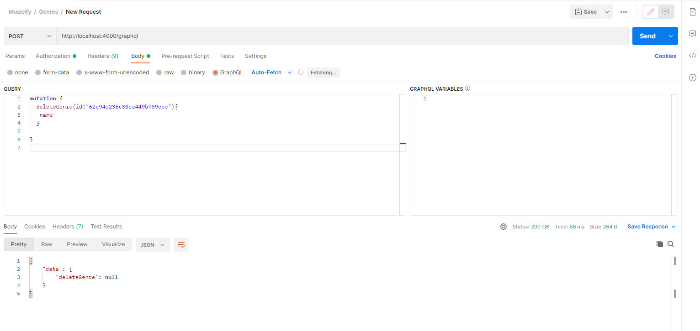

# task5_nodeJs_Graphql_Service

Для начала работы:

1. установить docker dekstop
2. npm install
3. выполнить docker-compose up -d
4. запустить REST сервисы
5. выполнить npm run start

ВНИМАНИЕ: проверяйте запросы в Postman, вот пример:

иначе Вставьте токен вместо "context.req.headers.authorization" в каждый файл resolvers
